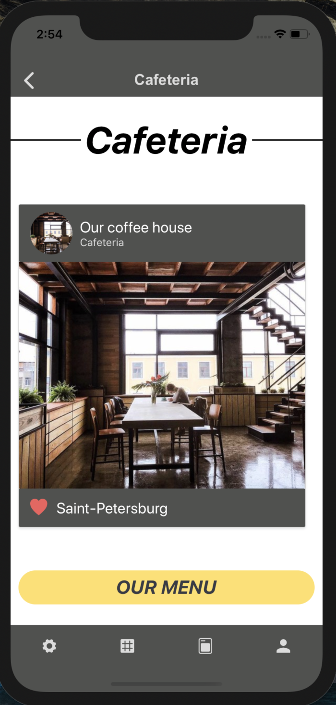
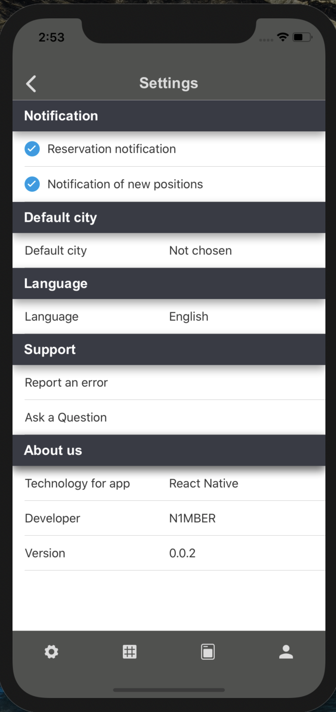
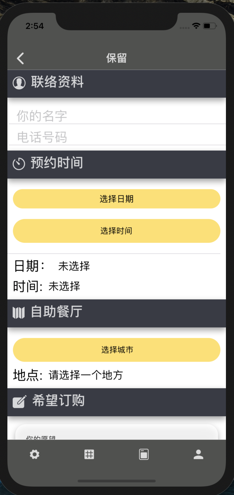
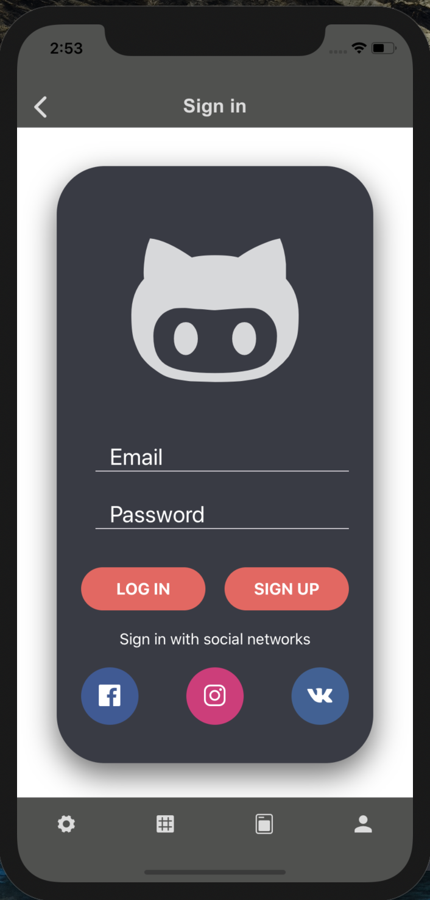
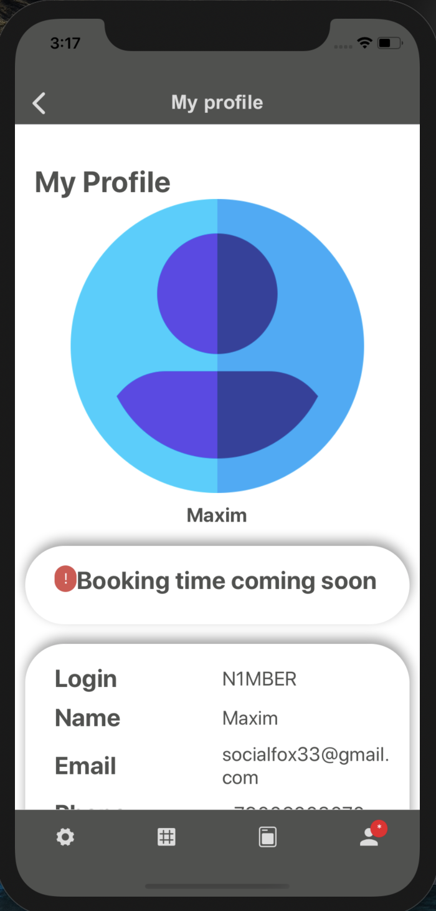
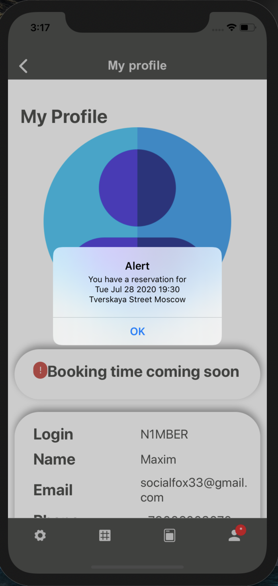

# Mobile application for coffee house

This application intended for coffee house. Here you can book a table,
 login to account or register, change settings, view menu and receive reminders 
 about your booked time and place.

## Start page

There are photos of coffee house, link on menu and visit rating button.

## Settings page

Here you can change your notification settings, choose default city,
 choose the language (Russian, English, Chinese, German), and write to us about problems.
 
This page on chinese (for example):

## Login page

## User page

Here you can change your phone number or password and also check your reservation
time:

